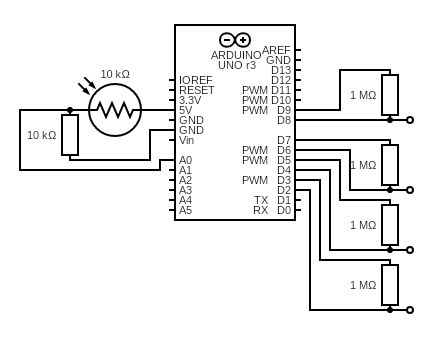
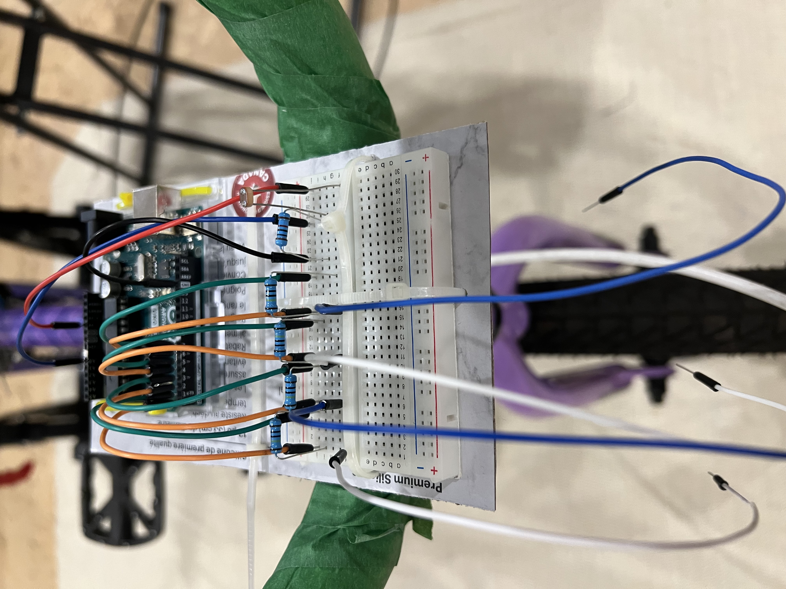
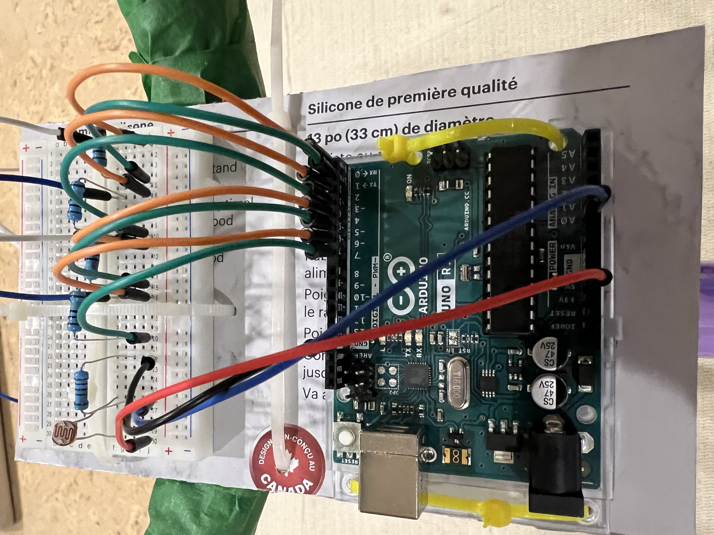

# Synth Bike

## Concept
when starting this project i was initially wanting to create some kind of synth instrument. Specifically, I was wanting to go very analog and build a synth with as little digital elements as possible. This intent was inspired by I video I saw of Jack White (leader/guitarist for the White Strips) build a simple one-string guitar out of some wire and a piece of 2x4, and I wanted to replicate this process witha synth. This led me down the rabbit hole of DIY analog synth making (which has a surprisingly big online community). In this rabbit hole I discovered a youtuber by the name of Look Mum No Computer, a channel run by Sam Battle. Battle has a lot of excellent tutorials how build synths and the different kinds of synth (such as a saw-tooth versus square-wave synth). He also has quite a lot of interesting projects that he has built which I began looking into. It was in a video where Battle was discussing his favorite projects when I saw his synth bike. This bike had what can only be described as an airplane control panel on its handle bar that Battle could ride around on playing unique sounds. I was immediately intrigued and wanted to try and build my own version of the bike. So, for better or worse I started watching I stopped watching Battle's video before he could explain his design and build process for the bike and began my own (I to take the initial inspiration from Battle, but realize the implementation of the bike without his influence).

In general the synth bike produces sound by running a synth on supercollider, where the cutoff limit for the synth being generated by the bike. The bike will create this cutoff limit for two sources, the keys on the handlebar and the speed of the back wheel. The keys are a capacitive touch sensor made out of aluminum foil. When a key is pressed an bit represented that key will be set in a result long integer (ie key 1 is represented by bit 1 in the result long integer). Once the Arduino checks which keys have been pressed it will bit-shift this result by 8 (this is to increase the audible range of the synth). Next the Arduino will check if a revolution has been completed for the back wheel. This is done by attching a photoresistor to the back of the bike frame and a flashlight to the wheel, where the Arduino will measure the time it takes for the flashlight to pass the photoresistor. This time is measured in milliseconds and is added to the results variable from before. Finally, the Arduino will print the result to serial which supercollider will interpret as the new cutoff limit (each new value the Arduino send is delinated by the character a).

For more information of how to build and run the project, check the circuit schema below and the functionality section.

## Circuit Schema

## Photos

## Video Explanation and Demo
https://youtu.be/NMW0AqCcAnw

## Functionality
The components for this project are
- an Arduino
- 4 aluminum foil capacitive touch sensors
- 1 1M ohm resistors
- 1 10k ohm resistor
- 1 photoresistor
- Supercollider IDE 

To run the code, import the Arduino code onto your Arduino, and import the supercollider code into the supercollider IDE and then run the following commands
- ~port = SerialPort.new("COM5", 115200); // ensure that the port matches the the port you connected your Arduino to
- s.boot;
- run the ~getValues routine
- run the synth definition
- ~synth = Synth(\saw, [\cutoff, ~val]); // ~val is the result from the Arduino
- run the ~control routine

Supercollider will now be receiving information from the Arduino which will determine the cutoff limit for the synth.

## References
### Tutorials Used for the Project
- Capacitive Touch Sensor: https://www.instructables.com/Capacitive-Sensing-for-Dummies/, https://hackaday.com/2015/11/30/conjuring-capacitive-touch-sensors-from-paper-and-aluminum-foil/
- Supercollider, Composition: https://youtu.be/lGs7JOOVjag?si=L9rw8zBRUCwIuvLn
- Supercollider, Arduino: https://www.youtube.com/watch?v=_NpivsEva5o
- Look Mum No Computer: https://www.youtube.com/@LOOKMUMNOCOMPUTER
- Look Mum No Computer, Synth Bike: https://youtu.be/LWqImNULtao?si=kBdLbUSQCMWFtvKq

### Image Sources from Video
-	https://www.google.com/url?sa=i&url=https%3A%2F%2Fwww.youtube.com%2Fwatch%3Fv%3DURIYLoMNSgk&psig=AOvVaw292t1762k1FRcX2QLYiF8s&ust=1707877331913000&source=images&cd=vfe&opi=89978449&ved=0CBMQjRxqFwoTCPjq3f-gp4QDFQAAAAAdAAAAABAR
-	https://www.google.com/url?sa=i&url=https%3A%2F%2Fwww.avshop.ca%2Frecording-recording-software%2Fwaves-element-2-0-virtual-analog-synth-plug-in-download&psig=AOvVaw292t1762k1FRcX2QLYiF8s&ust=1707877331913000&source=images&cd=vfe&opi=89978449&ved=0CBMQjRxqFwoTCPjq3f-gp4QDFQAAAAAdAAAAABAW
-	https://www.google.com/url?sa=i&url=https%3A%2F%2Fwww.lookmumnocomputer.com%2F&psig=AOvVaw1eN6s6--0iGha19RbyBGnA&ust=1707877473988000&source=images&cd=vfe&opi=89978449&ved=0CBMQjRxqFwoTCODrusOhp4QDFQAAAAAdAAAAABAE
-	https://www.google.com/url?sa=i&url=https%3A%2F%2Fsoundcloud.com%2Flookmumnocomputer%2Fsets%2Fhuman-procrastination&psig=AOvVaw1eN6s6--0iGha19RbyBGnA&ust=1707877473988000&source=images&cd=vfe&opi=89978449&ved=0CBMQjRxqFwoTCODrusOhp4QDFQAAAAAdAAAAABAI
-	https://images.squarespace-cdn.com/content/v1/5912db7ee6f2e1435dbab4fd/1497604689762-1UIZEV74DZE8JROGDCVK/look+mum+no+computer+live?format=2500w
